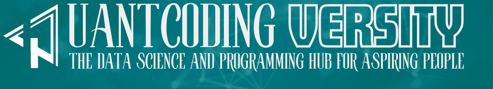

Welcome to Quant Coding Versity - your premier destination for diving deep into the world of data science, machine learning, deep learning, and a wide array of programming languages. Our mission is to provide high-quality, insightful, and up-to-date content that caters to both beginners and advanced practitioners in the field. 

## The Name of Quant Coding Versity Meaning
-------------------------------------------

The name **Quant Coding Versity** is coined by fusing **quantity** and **university,** t0 whisper the essence of this space. It's not just a place to learn the language of machines; it's a university of exploration, where the vast landscapes of data science, statistics, econometrics, applied mathemtics, remote sensing and more become your playground.

Think of it as your intellectual compass, guiding you through the intricate forests of applied data science, programming, software engineering and beyond. Here, you'll find yourself shoulder-to-shoulder with fellow adventurers, each driven by a thirst for knowledge and a passion for weaving narratives from the threads of data.

So, whether you're a seasoned data warrior or a wide-eyed explorer on your first quest, QCVersity awaits. Come join us, unravel the mysteries nestled within algorithms, and unlock the power of quantitative coding. The journey starts now, at QCVersity.

## The Story Behind QCVersity
-----------------------------

At the heart of **QCVersity** lies a journey that began with a simple, yet profound, mission: to share knowledge and assist students and researchers across the globe. It all started with online lectures, a small step that marked the beginning of an extraordinary venture.

As time passed, these sessions evolved into a treasure trove of educational material, a vast repository of knowledge that I had the privilege of creating. Initially, some of these resources found their way to GitHub, reaching a wider audience, eagerly seeking knowledge in the digital world.

However, a significant portion of my work remained unseen, tucked away in the confines of my laptop. This realization sparked an idea - why not breathe life into these dormant articles and materials? Why not create a space where they can flourish and benefit others?

Thus, **QCVersity** was born - not just as a website, but as a vibrant educational ecosystem. It's a place where dormant knowledge is awakened and shared, where curious minds come to learn, explore, and grow.

Moving forward, I am committed to dedicating more time and effort to develop this initiative. **QCVersity** is set to become a cornerstone for those who seek to unravel the complexities of data science, econometrics, programming, and beyond.

Joining me, I hope this pronoun will become Us sooner, on the journey at QCVersity, where knowledge is not just shared but brought to life, making the experience well-worth the journey, and empowering learners and researchers around the world. 

## The QCVersity Objectives
---------------------------

My approach to writing is as diverse as the subjects I cover. I believe that the length of an article should be determined by its content and the level of exploration needed. Hence, I create articles of different lengths – short, medium, and long – customized to capture the core of the subject matter.

My expertise lies in providing intricate details. With my meticulous attention to detail, I guarantee that each article is a comprehensive source of information. My objective is to provide readers with a complete understanding of the subject, leaving no stone unturned. This typically requires delving into what might be perceived as exaggerated detail. Yet, this thoroughness provides readers with comprehensive answers and a deep comprehension of the subject.

Beyond just presenting information, I strive to empower my readers. My articles often include insights into the art of gathering information and the skill of learning effectively. These ‘tricks of the trade’ are shared to enhance the reader’s own journey in acquiring knowledge and expertise.

In every piece, my aim is to not just inform but also to teach and inspire. Whether you’re a seasoned professional or a curious beginner, my articles are designed to guide you through the complexities of the subject and leave you with both knowledge and the means to further your understanding.

## The Main QCVersity Focus
--------------------------

At Quant Coding Versity, we are passionate about:

- **Data Science and Machine Learning**: Exploring cutting-edge techniques and applications in data science and machine learning. We delve into various algorithms, methodologies, and their practical implementations.

- **Deep Learning**: Unraveling the complexities of deep learning. Our articles cover neural networks, deep learning frameworks, and real-world applications.

- **Programming Languages**: Offering comprehensive guides and tutorials on languages such as R, Python, Julia, C, C++, Rust, Bash, and more. Whether you're starting out or looking to refine your skills, we have something for everyone.

- **Technical Tools**: Providing insights into a plethora of tools essential for data analysis, visualization, and computational efficiency.

- **Time Series and Econometrics**: Bridging the gap between theory and practice in time series analysis and econometrics. Our content ranges from introductory concepts to advanced modeling techniques.

## Our Commitment
-----------------

We are committed to:

- **Quality Content**: We are dedicated to providing high-quality content that is comprehensive, accurate, and packed with valuable insights. Our team of experts meticulously crafts each article, tutorial, and guide to ensure it meets the highest standards of excellence.

- **Community Engagement**: We believe in fostering a vibrant and interactive learning community. We actively engage with our readers through comments, forums, and social media, valuing their feedback and incorporating it into our content creation process.

- **Continuous Learning**: We are committed to staying at the forefront of the ever-evolving field of data science and machine learning. Our team continuously engages in professional development and research to bring you the most up-to-date and relevant information.

## Stay Connected
-----------------
We invite you to explore our site, engage with our content, and join our growing community. For updates, follow us on [facebook](https://www.facebook.com/drsaadlaouadi), join our [telegram channel](https://t.me/+3nlC1pP56uYzMmE0) subscribe to our [YouTube Channel] , or reach out to us at [email address](QuantCodingVersty).

Thank you for choosing **Quant Coding Versity** as your gateway to the world of quantitative and coding excellence!
